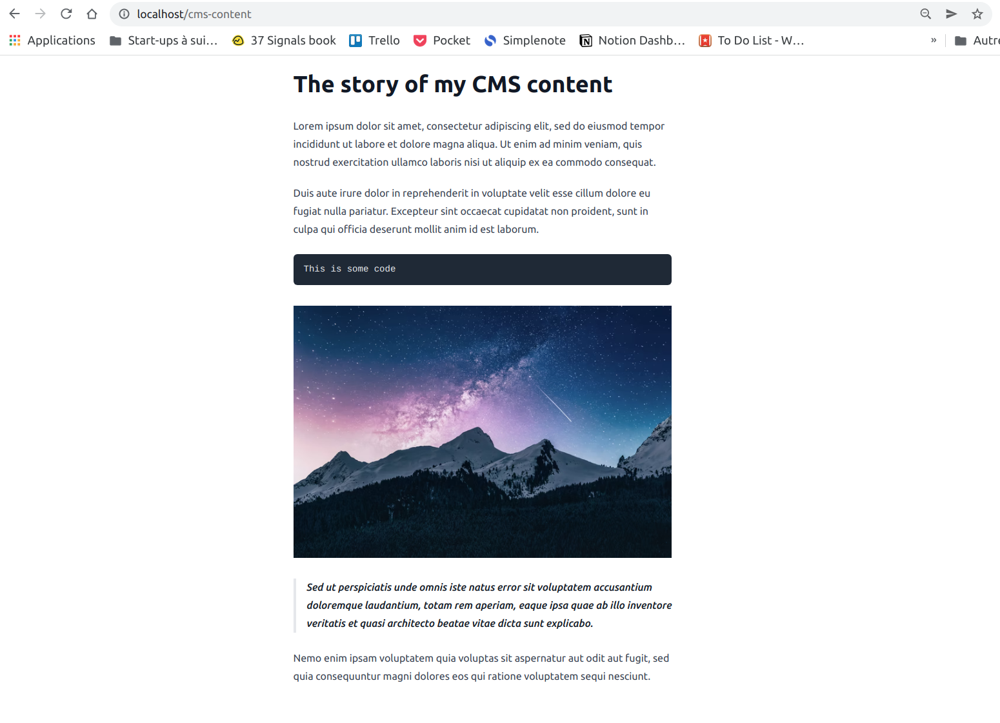

# Comment intégrer TailwindCSS v3 à un projet Symfony avec Webpack Encore

## Installation

L'installation de TailwindCSS peut déconcerter un peu au début, car le framework se base sur des pre-processeurs et bibliothèques JavaScript comme PostCSS et Autprefixer, mais finalement c’est assez simple, vous allez voir.

On va installer la dernière version (v3) de TailwindCSS.

Commençons par installer TailwindCSS ensemble avec les outils PostCSS et Autoprefixer:

```bash
// si on installe avec npm:
npm install -D tailwindcss postcss autoprefixer

// si on installe avec yarn:
yarn add --dev tailwindcss postcss autoprefixer
```

Petite explication de ces librairies:

* PostCSS est l’outil d’orchestration qui va transformer notre CSS avec Tailwind et Autoprefixer.
* TailwindCSS est notre framework CSS écrit en JavaScript 🙂
* Autoprefixer est un outil qui permet de rajouter automatiquement les préfixes CSS pour tous les navigateurs (```-webkit-```, ```-moz-```, ```-ms-``` etc.) afin de garantir la compatibilité de notre CSS sur la plupart des navigateurs et ce - sans nous en préoccuper. Pratique, non ?

## Configuration

Une fois installé il nous faut configurer rapidement TailwindCSS avant de l’utiliser.

Etape 1: Initialisons la config de TailwindCSS avec la commande:

```bash
// Si on utilise npm
npx tailwindcss init

// Si on utilise Yarn
yarn tailwindcss init
```

Ceci va créer un fichier ```tailwind.config.js``` à la racine de notre projet.

Pour l’instant il n’y a rien dans la config à part quelques options vides:

```js
module.exports = {
  content: [],
  theme: {
    extend: {},
  },
  plugins: [],
};
```

Mais on va pouvoir personnaliser cette config pour adapter au mieux Tailwind à notre projet.

Depuis sa version 3, TailwindCSS intègre un moteur de compilation dit JIT (Just in Time) qui analyse nos fichiers HTML et JS pour ne générer que le CSS dont on a besoin pour notre app. On évite ainsi de se retrouver avec un fichier CSS lourd, de plusieurs mégaoctets, qui contiendrait toutes les classes de Tailwind, même celles qu’on n’utiliserait pas dans notre projet.

Afin que TailwindCSS puisse scanner nos fichiers HTML et JavaScript à la recherche des classes CSS utilisées, il faut qu’on lui mentionne les chemins vers ces fichiers dans l’option ```content``` dans ```tailwind.config.js``` :

```js
// tailwind.config.js

module.exports = {
  content: [
    'templates/**/*.html.twig',
    'assets/js/**/*.js',
    'assets/js/**/*.jsx', // Si vous utilisez des fichiers React JSX
    ],
  theme: {
    extend: {},
  },
  plugins: [],
};
```

Ainsi Tailwind va comparer les classes CSS présentes dans ces fichiers avec ses propres classes et ne laisser dans le CSS buildé que les classes vraiment utiles.


Etape2: Ensuite, vu qu’on va builder notre CSS avec PostCSS et Webpack Encore il faut qu’on installe le loader PostCSS pour webpack:

```bash
// si vous utilisez npm
npm install -D postcss-loader

// si vous utilisez yarn
yarn add postcss-loader --dev
```

Et ajouter le loader PostCSS à la config webpack à la racine du projet:

```js
// webpack.config.js

Encore
    // ... other config lines are not displayed

    .enablePostCssLoader()
```

Etape 3: Pour que PostCSS compile notre CSS avec TailwindCSS et Autoprefixer il nous faut créer un fichier de configuration ```postcss.config.js``` à la racine de notre projet dans lequel on lui indique d’utiliser ces plugins :

```js
// postcss.config.js

module.exports = {
  plugins: {
    tailwindcss: {},
    autoprefixer: {},
  }
};
```

On ne va plus toucher à ce fichier par la suite.

Remarque: en fonction de votre version de PostCSS il se peut que ce fichier ne soit pas pris en compte automatiquement. Dans ce cas, essayez de rajouter le chemin vers la config PostCSS dans le fichier de config Webpack au niveau de la fonction ```.enablePostCssLoader()``` :

```js
// webpack.config.js

    ...
    .enablePostCssLoader((options) => {
        options.postcssOptions = {
            config: './.postcss.config.js'
        }
    })
```

Etape 4: Enfin dernière étape, il nous reste à inclure TailwindCSS dans notre fichier css principal au tout début du fichier :

```css
// assets/css/app.css

@tailwind base;
@tailwind components;
@tailwind utilities;

## Ressources
```

Ceci va indiquer à TailwindCSS de générer 3 couches (layers) de CSS:

* La couche ```base``` correspond à une série de “resets” en CSS qui permet de tout remettre à zéro pour partir sur de bonnes bases et assurer une cohérence pour tous les navigateurs;
* La couche ```components``` génère l’unique composant de Tailwind à ce stade (peut être qu’il y en aura plusieurs à l’avenir), qui est la classe ```.container```, utile pour rendre le contenu responsive;
* La couche ```utilities``` génère toutes les classes utilitaires de Tailwind.


Remarque: l’annotation ```@tailwind``` est une directive spécifique à TailwindCSS, ce n’est pas un standard CSS, mais lors de la compilation, Tailwind va la comprendre et générer le CSS correspondant à ces 3 couches.

Voilà, on est fin prêts à utiliser Tailwind dans notre code, il ne nous reste plus qu’à builder notre CSS pour voir le résultat :

```bash
// si vous utilisez npm
npm run encore dev

// si vous utilisez yarn
yarn encore dev
```

Vous devriez obtenir un résultat similaire à celui-ci :


On remarque que le fichier CSS obtenu ne fait que quelques dizaines de KB. Le moteur JIT de TailwindCSS a bien fait son job et n’a généré que le CSS qui est utile à notre app et rien de plus. On obtient donc un fichier CSS optimisé (parfait en production).

## Implémentation dans Twig

Maintenant on peut facilement utiliser toutes les classes de Tailwind dans nos templates Twig.

Par exemple :

```twig



    <div class="h-screen flex flex-col items-center justify-center">
        <h1 class="text-gray-500 text-4xl mb-4">Hello world</h1>
        <button class="px-4 py-2 bg-blue-500 hover:bg-blue-600 text-white rounded">
            Click here
        </button>
    </div>

```

On rebuild notre CSS pour que Tailwind puisse prendre en compte les classes présentes dans notre Twig :

```bash
// si vous utilisez npm
npm run encore dev

// si vous utilisez yarn
yarn encore dev
```

Note: Vous pouvez utiliser l’option ```--watch``` si vous ne voulez pas exécuter la commande à chaque fois.

Et en visitant notre page web on obtient notre première page stylisée par Tailwind :


Voilà, c’est tout ce qu’il faut faire pour intégrer TailwindCSS à votre projet Symfony.

Dans la suite de l’article je vous montre comment vous pouvez personnaliser encore plus TailwindCSS, selon vos besoins précis.

## Personnalisation du thème par défaut de TailwindCSS

Grâce à son fichier de configuration, Tailwind est un framework hautement personnalisable.

Imaginons que l’on veuille utiliser une palette de couleurs spécifiques à notre projet. On peut mettre à jour la config de Tailwind pour lui spécifier de prendre en compte nos propres couleurs. Par exemple:

```js
// tailwind.config.js

module.exports = {
  content: [
    'templates/**/*.html.twig',
    'assets/js/**/*.js',
    'assets/js/**.*.jsx', // If you use React JSX files
  ],
  theme: {
    extend: {
      colors: {
        'azure': '#31a7ff',
        'dark-blue': '#4960b5',
        'light-gray': '#cccccc',
        'dark-gray': '#464a58',
        'red': '#aa1c25',
        'orange': '#aa6021',
      }
    },
  },
  plugins: [],
};
```

Ceci va automatiquement générer toutes les classes qui ont des couleurs et avec nos propres noms de couleurs, comme ```.bg-azure```, ```.text-azure```, ```.border-azure```, ```.bg-dark-blue```, ```.text-dark-blue``` etc..

On peut personnaliser plein d’autres choses comme les breakpoints d’écran pour la partie responsive, les marges et le padding, les polices, les animations CSS, etc. Pour plus de détails je vous invite à lire la [documentation officielle](https://tailwindcss.com/docs/adding-custom-styles) à ce sujet.

## Personnalisation des boutons

Dans mon exemple précédent j’ai stylisé mon bouton de cette manière:

```html
<button class="px-4 py-2 bg-blue-500 hover:bg-blue-600 text-white rounded">
    Click here
</button>
```

Le seul inconvénient est que si j’ai des dizaines de boutons sur mes pages et qu’à chaque fois je dois ajouter ces classes à la main ça deviendrait pénible et difficilement maintenable.

Heureusement pour nous, on peut faire de la composition et créer des classes personnalisées auxquelles on peut appliquer ces classes utilitaires de Tailwind.

Dans notre fichier CSS principal, créons une classe ```.btn``` (comme dans Bootstrap) à qui on va appliquer les classes du bouton:

```css
// assets/css/app.css
@tailwind base;
@tailwind components;
@tailwind utilities;

@layer components {
    .btn {
        @apply px-4 py-2 bg-blue-500 hover:bg-blue-600 text-white rounded;
    }
}
```

Les directives ```@layer``` et ```@apply``` sont spécifiques à TailwindCSS. Lors de la compilation il va les comprendre et appliquer à la classe ```.btn``` les styles CSS qu’on lui a indiqué.

Remarque: même si ce n’est pas obligatoire, c’est une bonne pratique d’englober notre css custom dans l’un des 3 layers proposés par Tailwind (ici le layer ```components``` car on créé un composant ```btn```), ceci afin de ne pas avoir de conflit de classes lorsqu’on utilise à la fois des classes custom et classes Tailwind dans un même élément HTML.

Maintenant dans le HTML on peut remplacer toutes les classes utilitaires précédentes par la classe ```.btn``` :

```html
<button class="btn">
    Click here
</button>
```

Le résultat sur le navigateur sera identique.

Bien entendu, en plus de la classe ```.btn``` , on peut ajouter à ce bouton d’autres classes Tailwind spécifiques pour le personnaliser encore plus. Par exemple on pourrait imaginer définir une classe .```btn-primary``` qui définirait la couleur primaire du bouton. Libre à vous de faire ce que vous voulez.

## Personnalisation des formulaires

Si vous jouez un peu avec Tailwind vous remarquerez qu’un autre petit problème se pose: sur Bootstrap on avait l’habitude d’utiliser des classes comme ```.form``` , ```.form-row``` ou encore ```.form-control``` qui appliquaient automatiquement le style par défaut de Bootstrap à nos formulaires, mais sur Tailwind les formulaires sont complètement remis à zéro (par défaut, même les bordures des champs sont supprimées par le reset CSS).

Pour remédier à ce problème, on peut utiliser le plugin officiel ```@tailwindcss/forms``` qui va ajouter un certain nombre de presets utiles pour nos formulaires. Cependant on regrettera que ces presets ne sont pas aussi aboutis que sur Bootstrap (on aurait aimé ne rien faire de plus), mais je pense que les créateurs de Tailwind ont voulu laisser une liberté totale aux développeurs et éviter la surcharge CSS.

Il nous faudra donc personnaliser nous mêmes le style de nos champs de formulaire avec des classes utilitaires de TailwindCSS.

Installons donc le plugin ```@tailwindcss/forms``` :

```bash
// Si vous utilisez npm
npm install @tailwindcss/forms -D

// Si vous utilisez Yarn
yarn add @tailwindcss/forms --dev
```

Et ajoutons-le à notre config TailwindCSS :

```js
// tailwind.config.js

module.exports = {
  // ...

  plugins: [
    require('@tailwindcss/forms'),
  ],
};
```

Maintenant lorsqu’on créé un formulaire, ses champs seront stylisés par défaut. Mais le design est un peu trop basique, il faut l’adapter.

On devra ajouter des styles supplémentaires. On peut le faire pour tous nos éléments de formulaire en utilisant la composition de classes CSS.

Créons par exemple nos propres classes pour les éléments d’un formulaire :

```css
// assets/css/app.css

@tailwind base;
@tailwind components;
@tailwind utilities;

@layer components {
    .btn {
        @apply px-4 py-2 bg-blue-500 hover:bg-blue-600 text-white rounded;
    }

    /** Form classes **/
    .form-row {
        @apply mb-2 flex gap-4;
    }

    .form-label {
        @apply font-semibold w-1/4;
    }

    .form-field {
        @apply rounded border-2 border-gray-200 flex-grow;
    }

    .form-checkbox {
        @apply rounded border-2 border-gray-200;
    }
}
```

Dans notre HTML on peut désormais utiliser ces classes nouvellement créées :

```html
<form>
    <div class="form-row">
        <label class="form-label">First Name</label>
        <input type="text" name="first_name" class="form-field" />
    </div>
    <div class="form-row">
        <label class="form-label">Last Name</label>
        <input type="text" name="last_name" class="form-field" />
    </div>
    <div class="form-row">
        <label class="form-label">Email</label>
        <input type="email" name="email" class="form-field" />
    </div>
    <div class="form-row">
        <label class="form-label">Message</label>
        <textarea name="message" class="form-field" rows="5"></textarea>
    </div>
    <div class="form-row justify-center mb-4">
        <label class="form-label w-auto">
            <input type="checkbox" name="optin" class="form-checkbox mx-4"/>
            <span>Subscribe to our newsletter</span>
        </label>
    </div>
    <div class="form-row flex justify-center">
        <button class="btn">Send message</button>
    </div>
  </form>
```

Après le build de notre CSS, on obtient ce résultat, plutôt pas mal :


Tailwind laisse donc le soin au développeur de personnaliser les formulaires. Cela peut être un inconvénient quand on veut aller vite, mais ça a l’avantage de permettre une plus grande liberté d’action sur les formulaires afin de reproduire fidèlement le rendu d’une maquette de design, sans devoir surcharger le CSS (comme sur Bootstrap).

## Personnalisation du contenu provenant de CMS

Un autre plugin que je trouve intéressant à intégrer dans un projet est le plugin ```@tailwindcss/typography``` , qui permet d’appliquer à un contenu un joli style très abouti sans écrire une seule ligne de CSS.

Ce plugin est super pratique dans le cas où on a un contenu HTML provenant d’un CMS ou d’une autre source externe.

La plupart du temps c’est un vrai casse tête d’appliquer les styles qu’on souhaite dans ce type de HTML car on n’a pas le contrôle dessus (on n’a pas la possibilité d’ajouter des classes en amont).

Et bien grâce au plugin Typography de TailwindCSS on n’a plus vraiment à s’en soucier.

L’installation du plugin se fait de la même manière que pour le plugin Forms:

```bash
// Si vous utilisez Npm
npm install @tailwindcss/typography -D

// Si vous utilisez Yarn
yarn add @tailwindcss/typography --dev
```

Et comme pour tout plugin TailwindCSS il faut l’ajouter à la config ```tailwind.config.js```:

```js
module.exports = {
  // ...

  plugins: [
        // ...
    require('@tailwindcss/typography'),
  ],
};
```

Enfin dans notre HTML il nous suffit d’utiliser la classe proposée par défaut qui s’appelle ```.prose``` (le nom est joli je trouve) sur l’élément parent :

```html
<article class="prose">
    <h1>The story of my CMS content</h1>
    <p>
        Lorem ipsum dolor sit amet, consectetur adipiscing elit, ...
    </p>
    <p>
        Duis aute irure dolor in reprehenderit in voluptate velit esse ...
    </p>
    <pre>This is some code</pre>
    
    <blockquote>
        Sed ut perspiciatis unde omnis iste natus error sit voluptatem ...
    </blockquote>
    <p>
        Nemo enim ipsam voluptatem quia voluptas sit aspernatur aut odit ...
    </p>
</article>
```

Et voilà, après compilation du CSS on obtient cette élégante présentation de contenu:



On n’a rien eu à faire, pas d’écriture de CSS supplémentaire, ces styles marchent par défaut. Le gain de temps est énorme.

## Conclusion

J’espère que cet article vous a aidé à mieux comprendre le framework TailwindCSS, sa philosophie, ses spécificités et comment faire son intégration dans un projet Symfony.

Les innovations apportées sont très intéressantes, comme le moteur JIT qui génère du CSS optimisé, le degré de liberté et de personnalisation que permet le framework, le site officiel qui est une mine d’informations et un plaisir pour les yeux, et aussi la communauté grandissante qui propose de nombreux exemples de composants pour s’en inspirer.

Personnellement je l’utilise de plus en plus pour mes projets (d’ailleurs ce site utilise TailwindCSS) car cela m’apporte un gain de temps et moins de casse tête pour créer tout type d’interfaces. Une fois qu’on a appris comment fonctionnent les classes utilitaires de Tailwind et la composition de classes personnalisées, le travail sur le HTML est ensuite très rapide.

PS: Repo Github contenant l’app complète utilisée dans cet article : [Article](https://github.com/ygalescot/symfony-tutorials/tree/tailwind-in-symfony)

[Page originale](https://www.yourigalescot.com/fr/blog/comment-integrer-tailwindcss-v3-a-un-projet-symfony-avec-webpack-encore)

[Niveau supérieur](../index.md)
